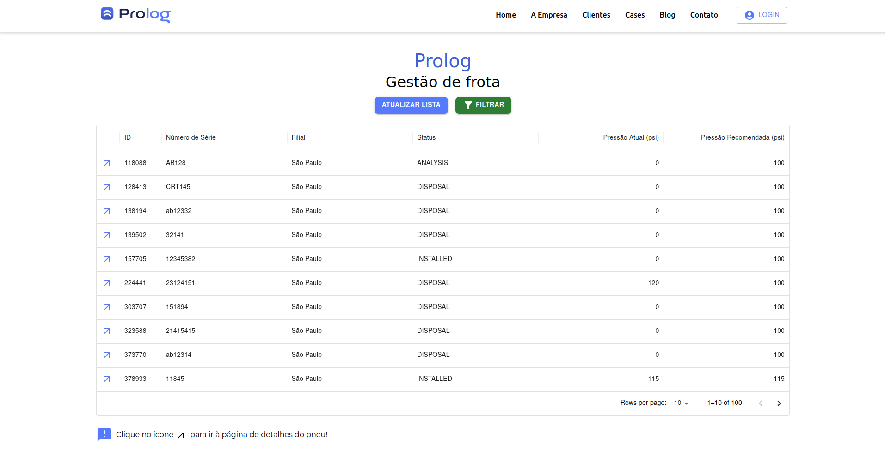
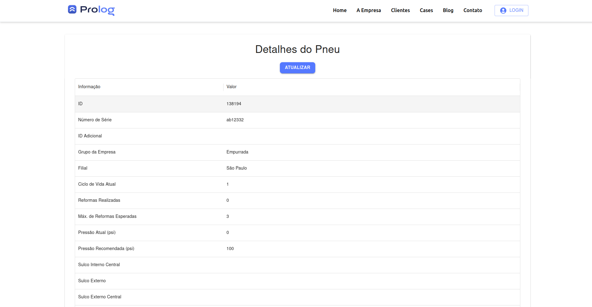
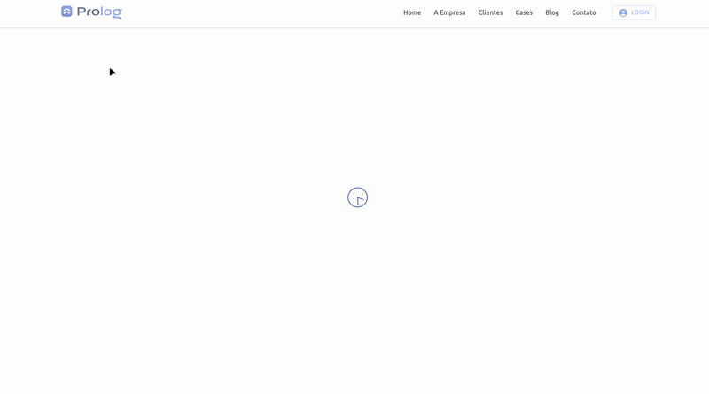
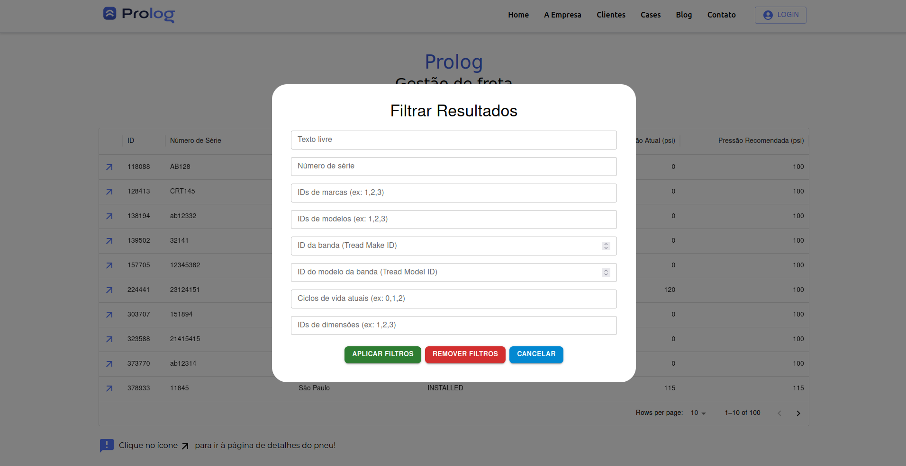
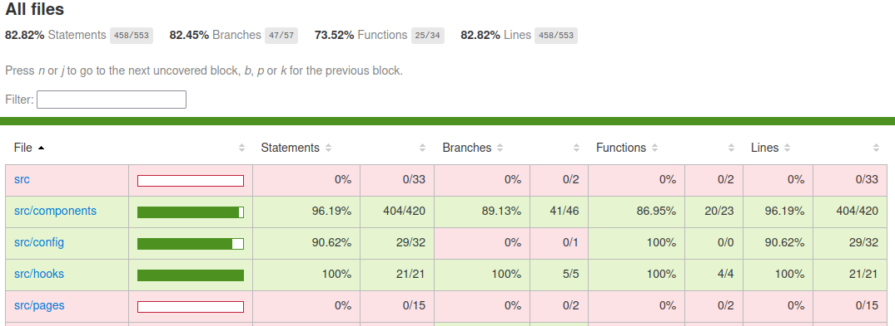
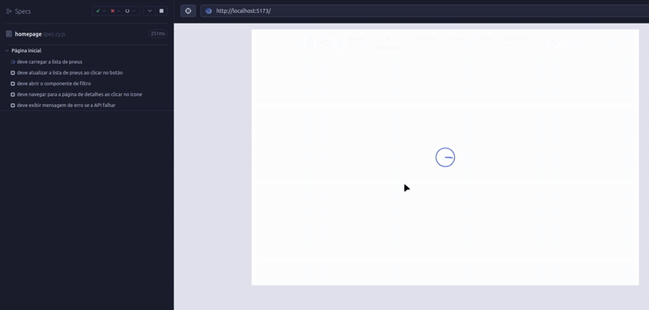

## ✅ Requisitos atendidos

- ✅ **ReactJS puro**: o projeto foi criado com Vite, utilizando apenas ReactJS.

- ✅ **TypeScript**: o projeto foi inteiramente desenvolvido com TypeScript, incluindo os testes.

- ✅ **Sistema de rotas**: implementado com `react-router`. As rotas estão centralizadas no componente `App.tsx`.

- ✅ **Listagem de pneus**:

  - Consome o endpoint de listagem: `GET /tires`

  - Exibe todos os pneus com paginação client-side.

  - Todos os filtros estão funcionais

- ✅ **Página de detalhes de pneu**:

  - Rota: `/tires/:tireId`

  - Consome o endpoint de detalhes por ID: `GET /tires/:id`

  - Exibe todas as informações do pneu selecionado.

- ✅ **Tratamento de erros**:

  - Falhas nas requisições são tratadas com fallback de erro.

  - Mensagens amigáveis são exibidas para o usuário.

- ✅ **Testes automatizados**:

  - Testes de e2e com **Cypress**.

  - Testes unitários e de integração com **Vitest + Testing Library**.

  - Cobertura de mais de 70% nos testes unitários, e 100% nos testes de integração e e2e.

## ⚙️ Decisões de projeto

- Não foi necessário usar um gerenciador de estado devido à simplicidade da aplicação. Adicioná-lo nesse caso seria contraproducente.

- Utilizei **MUI (Material UI)** como biblioteca de componentes visuais, estilizando-a de acordo com o guia de estilo fornecido.

- As informações sensíveis estão no arquivo `.env`, localizado na raiz do projeto. Embora esse arquivo devesse estar no `.gitignore`, optei por deixá-lo versionado neste caso, para que o avaliador possa executar a aplicação sem complicações.

- O projeto desenvolvido é uma **SPA (Single Page Application)**, ou seja, a navegação entre páginas ocorre sem recarregamento completo, otimizando a experiência do usuário e reduzindo o uso de recursos do servidor.

- A API não retorna o número total de elementos para uma pesquisa. Para contornar essa limitação, obtive todos os resultados de uma só vez (configurando o `pageSize` para 100) e implementei a paginação **manualmente do lado do cliente**. Embora não seja o ideal em escala, a solução funciona bem no contexto do desafio.

## 🚀 Funcionalidades extras

- 🧠 **Cache de requisições** na página de detalhes do pneu. Durante o intervalo estabelecido (15 segundos), os dados previamente carregados não são buscados novamente (observe no DevTools).

- 🎬 **Animações na UI** usando `framer-motion`.

- 📊 **Tabela com ordenação (sorting)** por colunas na listagem de pneus.

- 🛡️ **Validação das variáveis de ambiente com Zod**, garantindo maior robustez.

- 🔄 **"Load while stale"**: exibição de dados antigos enquanto os novos são carregados, melhorando a experiência do usuário.

## ▶️ Como rodar o projeto

⚠️ **Importante:** a porta `5173` precisa estar disponível, pois é utilizada pelos testes end-to-end com o Cypress. Caso ela esteja ocupada por outro processo, a aplicação emitirá um erro e a execução dos testes será impedida até que a porta esteja liberada.

🔒 **Atenção:** este repositório está marcado como privado, conforme solicitado na especificação do desafio técnico.  
Por isso, para cloná-lo, você precisa:

- Ter acesso concedido ao repositório (já feito para os avaliadores).
- Estar autenticado no GitHub via chave SSH **ou** usando um [Personal Access Token (PAT)](https://github.com/settings/tokens).

1. Clonagem via SSH (recomendado):

```sh
git clone git@github.com:trbenfica/prolog-app.git
```

2. Acesse o diretório do projeto

```sh
cd prolog-app
```

3. Instale as dependências

```sh
npm install
```

4. Inicie o servidor de desenvolvimento

```sh
npm run dev
```

## 🧪 Como rodar os testes

### ✅ Testes unitários e de integração (Vitest)

Os testes unitários e de integração estão localizados na pasta `src/components/__tests__` e `src/hooks/__tests__`.

Para executá-los, rode:

```sh
npm run test
```

Se quiser gerar um relatório de cobertura:

```sh
npm run coverage
```

O relatório será salvo na pasta `coverage/` e pode ser visualizado abrindo `coverage/index.html` no navegador.

### ✅ Testes end-to-end (Cypress)

Os testes de E2E com Cypress estão na pasta `cypress/e2e`.

1. **Certifique-se de que a aplicação esteja rodando em `http://localhost:5173`**:

```sh
npm run dev
```

2. **Execute o Cypress no modo interativo (GUI):**:

```sh
npm run cy:open
```

⚠️ **Importante:** a aplicação deve estar rodando **na porta 5173** para que os testes funcionem corretamente.

## Screenshots

### Página inicial



### Página de detalhes do pneu



### Animações



### Filtro da Homepage



### Cobertura dos testes unitários e de integração



### Execução dos testes e2e no Cypress


